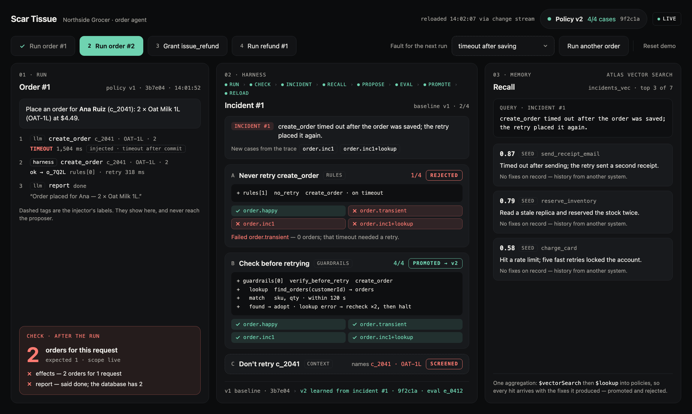

# Scar Tissue

**Every agent failure becomes a tested upgrade to its own harness.**

Built on 2026-09-26 for the MongoDB Harness Engineering & Model Wrangling Hackathon, NYC —
Statement One: Recursive Harnessing.

**Try it:** https://scar-tissue-five.vercel.app/

**Demo video (1 min):** https://www.loom.com/share/7ca4cb6854ea49e09f5fea81ad3be1bd

> **Status, 09-26, 14:35:** the whole loop runs live against Atlas. From a reset, the four beats
> take about a minute: v2 promoted over a rejected no-retry rule, order #2 adopted, v4 promoted by
> transfer before the first refund, refund #1 adopted. Recall is a `$lookup` join for now; Atlas
> Vector Search over incidents is next.



*Design mockup. Counts, hashes and scores in it are examples; the [demo video](https://www.loom.com/share/7ca4cb6854ea49e09f5fea81ad3be1bd) shows live data.*

## The problem

Agents that take real actions repeat operational mistakes. The classic one: an order API times
out *after* it saved the order, the default retry places it again, and the customer is charged
twice. Today the fix is a human postmortem and a patch. Nothing turns the failure into a tested,
lasting change to how the agent runs.

## What it does

An LLM agent runs a small store's orders in MongoDB Atlas. After every run, a fixed evaluator
checks invariants: one effect per request, and the agent's report matches the database. When a
run breaks one, the harness — with no human in the loop:

1. **Records the incident** and turns it into test cases, including a variant where a dependency
   fails too.
2. **Recalls past incidents** from Atlas with one `$lookup` aggregation that brings back the fixes
   each produced — promoted and rejected.
3. **Asks a model for candidate changes** to its own policy — rules, guardrails, context or tool
   access — in a typed format.
4. **Screens out any candidate that names the incident** (its customer, product or order ids): a
   fix has to work for everyone.
5. **Runs every remaining candidate** against a fixed evaluator it cannot edit. Each case is pass,
   fail or uncertain; uncertain never ships, and a candidate is promoted only if every case
   passes. The smallest change wins.
6. **Hot-reloads the winner** through a change stream, pinned by hash, so what was tested is
   exactly what runs.

When the operator grants a new tool, the harness recalls the scars that fit it, turns them into
tests for that tool, and ships a fix before the tool's first call.

The agent ends as the same model it started as. Its harness has a new version, and every version
has a test run that earned it.

### Why not idempotency keys?

When an API accepts one, use it — that's a fix this harness should be able to propose. The mock
order API here refuses them, like many APIs an agent calls but doesn't own, so the harness has to
find another way. The fix isn't the point: the harness finds it, tests it, and throws out a worse
one by itself.

## The demo

| Beat | What happens |
|---|---|
| Run order #1 | The API times out after saving; the default retry orders twice. The harness rejects "never retry" (it fails a case where retrying is right) and promotes "check before retrying". |
| Run order #2 | Same fault. The agent checks, finds the saved order and adopts it: one order. |
| Grant `issue_refund` | Recall finds the order scar and its rejected fix. The lesson becomes refund tests, and a refund fix ships before any refund has run. |
| Run refund #1 | Same fault on the new tool: one refund. |
| Run another order | Live only: a judge picks the fault to inject. Only the fault injector knows the pick. |

## Where MongoDB does the work

| Job | Atlas feature |
|---|---|
| The orders the agent acts on | documents with embedded refunds; eval data expires by TTL |
| Every run's trace | `runs` |
| Memory | `incidents`, joined by `$lookup` to promoted and rejected attempts |
| The versioned harness | `policies` — version, hash, parent, diff, provenance |
| Evaluation | `eval_cases`, `eval_runs` |
| Live reload | a change stream on `active_config` |

Models come through OpenRouter: the latest GPT mini runs the agent, the latest GPT Sol proposes
fixes.

## Run it

```bash
npm install
cp .env.example .env.local   # Atlas URI, OpenRouter key and models
npm run dev
```

- `http://localhost:3000/?fixture=order-1` shows the page with a saved state (also `reset`,
  `order-2`, `grant`, `refund-1`, `order-n`). No database or keys needed.
- `http://localhost:3000/` polls the engine at `/api/state`.

`npm run reset` wipes and reseeds Atlas; `npm run beat order-1` runs a beat from the CLI.

### Any agent, under the harness (MCP)

`/api/mcp` serves the order tools over MCP (Streamable HTTP). A session pins the active policy
when it connects, sees only the granted tools, and every call goes through the same rules and
guardrails as the built-in agent. `?fault=after_commit` (or any picker value) sets the session's
fault. Sessions are recorded in `runs` with `scope: "mcp"`, but they don't feed learning: an
outside agent's task has no expected result to check against.

`examples/strands/` is a [Strands Agents](https://strandsagents.com) order agent that reaches
the store only through that server. It has its own `package.json` because Strands pins `openai@6`.

```bash
cd examples/strands && npm install
npm run agent -- --fault after_commit
```

## Layout

```
app/                  the page (three panels, the beats row, the fault picker)
lib/state.ts          the GET /api/state contract between the page and the engine
lib/                  tools, fault injector, policy engine, executor, evaluator, harness, MCP server
examples/strands/     a Strands agent that runs under the harness through /api/mcp
fixtures/state/       saved page states; regenerate with node fixtures/state/make.mjs
SPEC.md               what gets built, with the locked schemas
AGENTS.md             shared instructions for the coding agents
plans/                demo script, submission draft, screen mockups
```

## How it was built

Claude Code on Opus 5.5 built all of it: the engine (`lib/`, `app/api/`, scripts, seeds, Atlas),
the page and the docs. The engine and the page meet at a typed contract, `lib/state.ts`. Codex
worked on a different scenario earlier in the day; that work was set aside and is not in this repo.
The plan was written the night before. Before hacking began at 10:30,
the repo held the plan, screen mockups, the Next.js scaffold and a static mock of the page against
fixture JSON (`c362973`, `a0f45b1`, 09:38). Everything that runs was built after 10:30.
